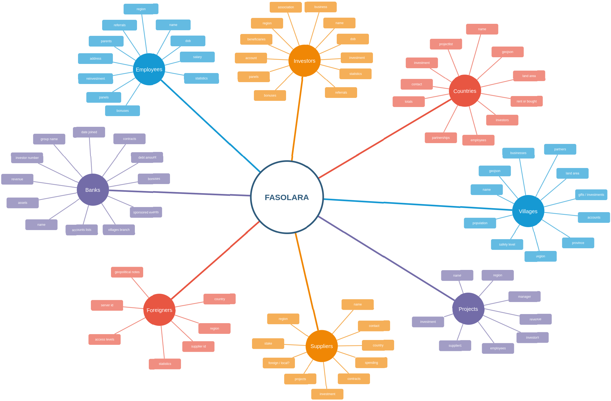

# Apollo GraphQL server for the FasoLara Platform

This repo replaces Express GraphQL with Apollo GraphQL. Will enventually support subscriptions. This has user authentication and uses middlewares to secure the majority of the GraphQL queries

## Functionalities available

- <b>models</b>: user, login, registerUser, account, address, bank, comment, country, location, employee, order, panel, project, province, salary, supplier, transaction, village
- <b>typeDefs</b>: user, login, registerUser, account, address, bank, comment, country, employee, order, panel, project, province, salary, supplier, transaction, village
- <b>resolvers</b>: user, login, registerUser, createAccount, createAddress, getAllAccounts, getAllAddresses

## Functionalities to Implement

- <b>Models</b>: location, message
	-  create, update, delete
- <b>Resolvers</b>: account, address, location, panel, project, transaction
	- create, update, delete, Get
- <b>typeDefs</b>:  location, message
	- Create, Update, Delete, Get
- <b>Subscription</b>: All

# Database Design

## Testing

- <b>Apollo Server</b>
	-	Supertest
	- EasyGraphQLTester
	- Mocha
	- Chai
